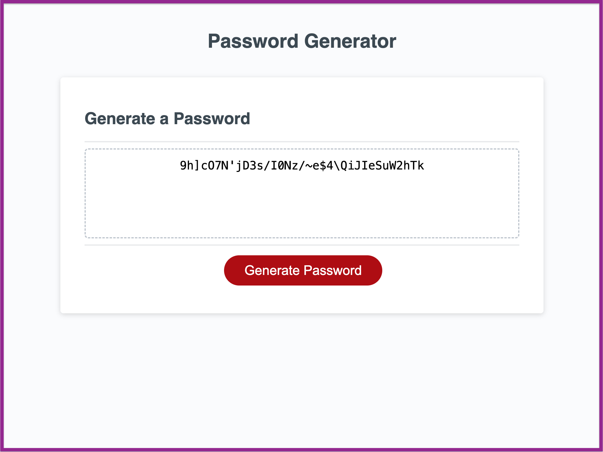

# Password Generator

## Description

In this project I was required to create a random password generator that employees can use in their personal or professional life. There were multiple criteria that allows the user to fine-tune precisely what characters they want featured in the password.

The app has been created primarily using JavaScript with some simple HTML and CSS to make the user experience better.

_Find the link to the the deployed website [here](https://prodigalprogrammer.github.io/Console-Finances/)_

(<a href="#password-generator" >Back to top</a>)

## Usage

Once you open the Console, you will be greeted with a simple text area and button.

Click the "Generate Password" button and an alert will follow prompting you to select a number between 8 and 128. You will not be allowed to select characters other than this number range.

After this you will be prompted to include four different types of characters:

- Special Characters (`!?.-_=+`)
- Numerical Characters (`036178`)
- Lower Cased Characters (`qwerty`)
- Upper Cased Characters (`QWERTY`)

The more types selected, the stronger your password will be. But you must select **at least one** type.

As an example, I can choose to have 18 characters in my password, select only special and numerical characters and will end up with something like the code below :

`5'~~{.{0^?-)-~?)(5`

As you can see there are no characters from the alphabet.

(<a href="#password-generator" >Back to top</a>)

## Features

### Functions

- There were a lot of Function expressions throughout this project and understanding scope as well as calling and declaring of Functions was essential.

### IF & ELSE statements

- I used many IF statements so only certain blocks of code would operate based on the user's choices.

### For Loop

- The For Loop was probably the most important thing used to make this app funtion correctly. It allowed me to quickly extract many random characters from arrays.

(<a href="#password-generator" >Back to top</a>)

## License

Distributed under the MIT License. See `LICENSE.txt` for more information.

## Contact

Project Link: [https://github.com/prodigalProgrammer/password-generator](https://github.com/prodigalProgrammer/password-generator)

Monrone Stewart: [YouTube](https://www.youtube.com/@ProdigalP) - prodigalprogrammer7@gmail.com

(<a href="#password-generator" >Back to top</a>)

## Acknowledgement

- [GitHub Pages](https://pages.github.com/)
- [The Complete JavaScript Course 2024: From Zero to Expert!](https://www.udemy.com/course/the-complete-javascript-course/)

(<a href="#password-generator" >Back to top</a>)

